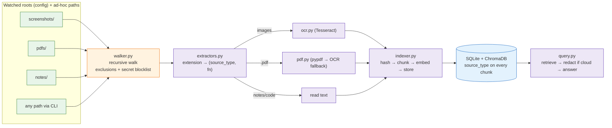

# Personal Knowledge OS — Phase 2 PRD & Design: Multi-Source Indexing (PDFs, Notes, Code)

**Status:** Approved design, pre-implementation
**Date:** 2026-07-18
**Depends on:** Phase 1 (Screenshot Intelligence) — complete, 79 tests passing
**Next step after approval:** detailed implementation plan via superpowers:writing-plans

---

## 1. Overview

Phase 1 built a local-first pipeline that watches one screenshots folder, OCRs
images, embeds text locally, and answers questions with citations. Phase 2
extends the same pipeline to three new source types — **PDFs** (digital and
scanned), **notes** (markdown/plain text), and **code files** — across
**multiple watched folders**, with **recursive** directory handling.

Nothing about the retrieval/answer side changes: the same local embeddings,
the same ChromaDB + SQLite stores, the same redact-before-cloud-egress gate,
the same citation format. Phase 1 already stores a `source_type` on every
document and chunk and can filter queries by it, so the storage and query
layers need no schema change.

### 1.1 The problem (user's perspective)

Personal knowledge is scattered across file formats, and no single local tool
searches inside all of them by meaning:

- People remember *what something was about*, not its filename or format.
  "That doc about the invoice approval flow" could be a PDF, a note, or a
  screenshot — today that means searching three apps three different ways.
- OS file search barely reads inside PDFs and matches keywords only; a note
  that says "authentication issue" is invisible to a search for "login bug".
  Anchor matches by meaning.
- **Scanned PDFs (receipts, signed forms, old records) are invisible to every
  normal search tool** — they are pictures of text. Phase 2 OCRs them.
- Code search (grep/IDE) needs exact strings and one project at a time;
  anchor answers "where do we configure the retry backoff?" in plain English
  across any folder the user points it at.

After Phase 2, one command searches all of it at once and cites the actual
file paths, so the user always lands back at the original file.

### 1.2 What makes anchor different

- **Local-first vs. cloud "chat with your docs" tools** (NotebookLM, ChatGPT
  uploads): those require uploading files to a server. Anchor's corpus never
  leaves the machine; at most the top-k matching snippets (a few KB, secrets
  redacted) go out, only with explicit consent; `--local` sends nothing ever.
- **Deliberate ingestion vs. Recall-style capture-everything**: anchor reads
  only folders the user configured or explicitly pointed it at, and
  hard-blocks secret files from ever entering the index.
- **One semantic index across formats** — screenshots + scanned/digital PDFs
  + notes + code — free (no paid APIs), offline-capable (extractive mode),
  with honest citations (deleted files never appear in answers).

## 2. Goals

1. `anchor index` / `anchor watch` / `anchor prune` operate over a **list of
   configured folders** (user keeps one folder per content type by
   convention), not a single `watch_dir`.
2. Any command also accepts an **ad-hoc path** that was never configured:
   `anchor index ~/some/folder`, `anchor watch ~/some/folder`,
   `anchor prune ~/some/folder`.
3. Indexing and watching are **recursive**, with a fixed exclusion list for
   junk/dependency directories.
4. **PDF support**: text-layer extraction for digital PDFs; per-page OCR
   fallback for scanned pages, using the existing Tesseract install.
5. **Notes and code support**: curated extension list, read as UTF-8 text.
6. **Secret-shaped files never enter the index** (hard blocklist at ingestion,
   because redaction only guards cloud egress).
7. Query-side filtering by type: `anchor ask/find --type pdf|note|code|screenshot`,
   plus keyword inference ("in my pdf about…") like Phase 1 does for
   "screenshot".
8. Deletion handling (live watcher removal, index auto-prune, `prune`
   command) works identically for all new types and all roots.

## 3. Non-Goals (Phase 3+)

- Browser history import (Phase 3 per the original brief).
- Unified cross-source synthesis features beyond what retrieval already gives
  (Phase 4).
- Web UI, clipboard capture.
- `.docx`, `.epub`, `.ipynb` extraction.
- Syntax-aware code chunking (character chunking is v1 for code too).
- Non-English OCR.
- Incremental re-index of individual changed PDF pages (whole-file re-index
  on hash change, as Phase 1 does for images).

## 4. User Stories

- *Find that PDF*: "Which pdf mentioned the invoice approval flow?" →
  `anchor find "invoice approval" --type pdf` lists matching PDFs with
  snippets; `anchor ask` gives a synthesized answer citing file paths.
- *Scanned receipts*: I drop a scanned receipt PDF into my PDFs folder; the
  watcher OCRs it within seconds and it becomes searchable.
- *Notes*: my markdown notes folder is indexed recursively; "what did I write
  about the deployment checklist?" answers from my own notes.
- *Code*: `anchor index ~/projects/myapp` indexes the source files (never
  `node_modules`, never `.env`) so "where do we configure the retry backoff?"
  finds the right file.
- *Privacy*: my `.env`, key files, and certificates are never readable
  through anchor, even if they sit inside an indexed folder.

## 5. Functional Requirements

### FR1 — Extractor registry (`src/anchor/extractors.py`, new)

Single table mapping extension → (source_type, extractor function):

| Extensions | `source_type` | Extraction |
|---|---|---|
| `.png .jpg .jpeg .webp .bmp` | `screenshot` | existing `ocr.extract_text_from_image` |
| `.pdf` | `pdf` | `pdf.extract_text_from_pdf` (new) |
| `.md .txt .rst` | `note` | read UTF-8 text (`errors="replace"`) |
| `.py .js .ts .jsx .tsx .java .c .cpp .h .go .rs .rb .php .sh .sql .html .css` | `code` | read UTF-8 text |
| `.json .yaml .yml .toml .ini` | `code` | read UTF-8 text |

API:

- `EXTENSION_TYPES: dict[str, str]` — extension → source_type.
- `classify(path) -> str | None` — source_type or None if unsupported.
- `extract(path) -> tuple[str, str]` — `(source_type, text)`; raises on
  unsupported (callers gate with `classify` first).

`ocr.IMAGE_EXTENSIONS` remains where it is (extractors imports it), so
existing imports keep working.

### FR2 — PDF extraction (`src/anchor/pdf.py`, new)

- Text layer per page via **pypdf** (pure Python).
- A page yielding fewer than `MIN_TEXT_CHARS_PER_PAGE = 30` characters is
  treated as scanned: render that page only (pdf2image/poppler, ~200 DPI) and
  OCR it with the existing Tesseract wrapper.
- OCR fallback capped at `MAX_OCR_PAGES = 50` text-less pages per file; when
  the cap triggers, print one notice line to stderr with the path and skipped
  page count (never content).
- Page texts joined with blank lines; empty result → indexer's existing
  `"empty"` status.
- Corrupt/encrypted PDFs: exception caught by existing per-file handling
  (exception class name logged, never content).

### FR3 — Recursive walker (`src/anchor/walker.py`, new)

One module owns "which files under this root are indexable", used by BOTH
`anchor index` and the watcher so rules cannot drift:

- `EXCLUDED_DIR_NAMES`: any hidden dir (name starts with `.`), plus
  `node_modules`, `.venv`, `venv`, `__pycache__`, `dist`, `build`, `target`,
  `.next`. Exclusions apply to directories *under* the root — the root itself
  is always walked, even if its own name would match (the user chose it
  explicitly).
- `SECRET_FILE_PATTERNS` (fnmatch, case-insensitive):
  `.env*`, `*.pem`, `*.key`, `id_rsa*`, `id_ed25519*`, `*.p12`, `*.pfx`,
  `credentials*`, `secrets.*`.
- `is_secret_file(path) -> bool`.
- `iter_files(root) -> Iterator[Path]` — deterministic (sorted) recursive
  walk; skips excluded dirs, symlinks, files resolving outside `root`,
  secret files, unsupported extensions, oversized files.
- Size caps move here: `MAX_FILE_BYTES = 20_000_000` (images/text/code),
  `MAX_PDF_BYTES = 50_000_000` (scanned PDFs run large).
- `is_indexable(path, root) -> bool` — same rules for a single path; the
  watcher uses this for events.

### FR4 — Config: multiple roots (`src/anchor/config.py`, modified)

- New field `watch_dirs: list[Path]` (default: the Phase 1 default folder as
  a one-element list).
- Back-compat: a config.json containing only the old `watch_dir` key behaves
  as `watch_dirs = [watch_dir]`. If both present, `watch_dir` is prepended if
  not already listed. A `watch_dir` property returns `watch_dirs[0]` so
  existing code and tests keep working.
- No other config changes. No DB schema change; no reindex required.

### FR5 — Indexer (`src/anchor/indexer.py`, modified)

- `index_file()` routes through `extract()` instead of image-only OCR;
  stores the extractor's `source_type` (Phase 1 hardcoded `"screenshot"`).
- New status `"blocked"` returned for secret-shaped files, even when the user
  names one explicitly (`anchor index ~/x/.env` refuses) — defense in depth
  beyond the walker.
- Existing statuses unchanged: `indexed / unchanged / unsupported / empty /
  removed / unknown`.
- `prune(under=...)` unchanged (already path-scoped).

### FR6 — Watcher (`src/anchor/watcher.py`, modified)

- `run_watcher(roots: list[Path], indexer)` — watches all roots at once,
  `recursive=True`.
- Roots grouped by backend: `/mnt/*` roots (and `ANCHOR_FORCE_POLLING=1`) on
  one `PollingObserver(timeout=2)`; native roots on one inotify `Observer`.
  Both run simultaneously; Ctrl-C stops both.
- Event handling delegates to `walker.is_indexable` (extension, secret
  blocklist, excluded-dir ancestry, containment, size). Delete/move events
  skip the size/secret checks that need the file present, but still gate on
  extension + containment + excluded-dir ancestry.

### FR7 — CLI (`src/anchor/cli.py`, modified)

- `anchor index` (no args): syncs **every** configured root — walker-driven
  recursive index + per-root prune. Prints per-file status lines exactly as
  today, plus `removed` lines.
- `anchor index <path>`: same treatment for any file or folder.
- `anchor watch [path]`: positional path (optional). No args → all configured
  roots. `--dir` kept as an alias for back-compat.
- `anchor prune [path]`: optional scope argument (no args = whole index, as
  today).
- `anchor find` / `anchor ask`: new `--type {screenshot,pdf,note,code}`
  argument (argparse-validated) that overrides inference.
- `infer_source_type()` extended: "screenshot"/"image" → screenshot;
  "pdf"/"document" → pdf; "note"/"notes" → note; "code"/"script" → code.

### FR8 — Deletion sync (already built, extended by the above)

Live watcher removal, `anchor index` auto-prune, and `anchor prune` work for
all roots and all types with no new mechanism — deletion handling is
type-agnostic (path-keyed), and prune scoping composes with multiple roots by
looping.

## 6. Architecture

*Everything to the right of the extractors is Phase 1 code, unchanged.*

Design rationale (chosen over per-type indexer subclasses and content
sniffing): all types share the same hash/chunk/embed/store pipeline today, so
a registry keeps one pipeline and makes a future type a one-line addition;
extension dispatch (vs sniffing) keeps coverage predictable and matches the
curated-list decision.

## 7. Security Model (deltas — every Phase 1 guarantee still holds)

1. **Secrets never enter the index.** Redaction protects cloud egress only;
   once text is in SQLite/Chroma it is searchable. Therefore secret-shaped
   files are blocked at ingestion (walker + indexer double gate). Inline
   secrets in ordinary code files are still covered by the existing
   redact-before-egress pass; `--local` remains the recommendation for
   sensitive queries.
2. **Recursive walking is the new attack surface**: symlinks skipped and
   containment (`resolve()` under root) enforced at every depth; excluded
   dirs stop dependency-tree ingestion (`node_modules`, `.venv`, …); hidden
   dirs skipped wholesale.
3. **PDF parsing**: pypdf is pure Python — a malformed PDF can raise, not
   corrupt memory. Per-file exception isolation (class name only in logs)
   already exists. Size cap (50 MB) and OCR page cap (50) bound resource use.
4. **No new egress paths.** New deps (pypdf, pdf2image) do no network I/O;
   poppler is a local system package.
5. Unchanged: local-only embeddings; `allow_cloud` consent model
   (`--cloud`/config, `--local` always wins); keys only via env /
   `~/.anchor/env` 0600, sent in headers; parameterized SQL; untrusted-snippet
   prompt guard (notes/code/PDFs are equally untrusted); no content in logs;
   data dir 0700, DB 0600.

## 8. Constraints

- Free-tier APIs only; no paid services; no provider SDKs (raw REST).
- Embeddings always local; corpus never leaves the machine.
- Python ≥ 3.11; WSL2 environment; `/mnt/*` roots require the polling
  watcher.
- No DB schema migration — Phase 1 databases must keep working untouched.
- All existing tests (79) must keep passing throughout.
- TDD per task: failing test → implement → pass → commit.
- Git: plain commits, no co-author trailers.
- New system dependency `poppler-utils` installed manually by the user via
  sudo (same procedure as tesseract in Phase 1).
- **All Python dependencies install into the project virtual environment
  only** (`.venv/bin/pip` in the repo) — never global pip, never system
  Python. Apt-installed system packages (tesseract, poppler) are the sole
  exception and are always run manually by the user.

## 9. Assumptions

- The user's PDF/notes folders will live on the Windows side (`/mnt/c/...`)
  like the screenshots folder, hence polling; native-Linux roots also work.
- Character chunking (1500/200) is acceptable for code and notes in v1.
- `all-MiniLM-L6-v2` embeddings are adequate for code/notes retrieval; no
  model change (a swap would force a full reindex — out of scope).
- OCR language is English only.
- A file's extension is a truthful signal of its content (misnamed files may
  extract poorly; acceptable for a personal curated corpus).
- Watched folder count stays small (< 10 roots), so one observer per backend
  scales fine.

## 10. Success Criteria

1. `anchor index` with a digital PDF, a scanned PDF, a markdown note, and a
   Python file under configured roots → all four indexed with correct
   `source_type`; `anchor ask` cites them; `anchor find --type pdf` filters.
2. `anchor index ~/never-configured/folder` works recursively without
   touching config.
3. A `.env` file placed inside a watched folder never appears in the index
   (verified by direct DB/vector query in tests).
4. `anchor index ~/project` with a `node_modules` tree indexes source files
   only.
5. Deleting a PDF/note/code file is removed by watcher, `anchor index`, and
   `anchor prune` exactly like screenshots (ghost-free answers).
6. All Phase 1 tests still pass; new tests cover every FR (target: every
   walker guard and extractor route has a test, mirroring Phase 1's security
   test discipline).
7. Live verification against the user's real folders, as in Phase 1.

## 11. Rollout / Migration

1. Implementation lands behind no flags — existing single-folder screenshot
   setups behave identically (back-compat `watch_dir` handling).
2. User runs `sudo apt-get install -y poppler-utils`; pip deps land in the
   existing venv via `pip install -e ".[dev]"`.
3. User adds folders to `watch_dirs` in `~/.anchor/config.json` when ready
   (documented in GUIDE.md at the end of implementation, with README updated
   too).
4. No reindexing of existing screenshots needed.

## 12. Resolved Questions (decision log)

- Scope: all three source types in this phase — **decided by user**.
- Ingestion: configured per-type folders **plus** ad-hoc paths everywhere —
  **decided by user**.
- Recursion: recursive with exclusions — **decided by user**.
- PDFs: digital + scanned (OCR fallback) — **decided by user**.
- File types: curated common set; secret files hard-blocked — **decided by
  user**.
- Architecture: extractor registry over subclassing/sniffing — **decided by
  user**.
- Docs: this PRD/design doc + an implementation plan — **decided by user**.
